---
title: "b2rust "
date: "2023-07-17"
doccode: "C_D270"
version: "v01.00"
subtitle: "User Manual"
author: "Christophe CHEN"
colorlinks: true
header-includes:
- |
  ```{=latex}
  \usepackage{awesomebox}
  \usepackage[utf8]{inputenc}
  \usepackage[french]{babel}
  ```
pandoc-latex-environment:
  importantblock: [requirement]
  noteblock: [note]

...
# Introduction

Ce document sert de **manuel utilisateur** pour **b2rust**. Il présente ses **contraintes d'utilisation** et les **choix des traductions** des modèles B en Rust.

# Lancer b2rust

## Configuration

### Fichier ressource

Ajouter les lignes suivantes dans le fichier ressource **AtelierB** de votre projet :  

        ATB*BCOMP*Allow_Becomes_Member_Of:TRUE  
        ATB*BCOMP*Allow_Becomes_Such_That:TRUE  
        ATB*TC*Allow_Becomes_Member_Of:TRUE  
        ATB*TC*Allow_Becomes_Such_That:TRUE  
	

Ces lignes sont nécessaires pour générer le `bxml` des implementations qui utilisent les instructions :  
- **vv :: E** (Becomes in)  
- **vv : (vv : E)** (Becomes such that)  

### Fichier de configuration

b2rust a besoin de connaître le répertoire où se trouvent ses trois fichiers de configuration :   
-**b2rust_types.cfg**  
-**b2rust_operations.cfg**  
-**b2rust_exceptions.cfg**.  

Par défaut, ces trois fichiers de configuration sont présents dans le répertoire **files** de b2rust. Lancez la commande :

	export B2RUST_CONF_HOME=~/path/to/b2rust/files  

Si vous avez besoin de modifier la configuration de b2rust, vous pouvez copier ces fichiers et les rééditer dans un autre répertoire. N'oubliez pas de mettre à jour le chemin.

## Génération du code

### Génération du bxml

b2rust traduit en fait le `bxml`. Un fichier script `gen_bxml.sh` est fourni pour créer le `bxml` à partir des fichiers d'extension **mch**, **ref** et **imp**.  

Pour exécuter ce script, il est recommandé d'ajouter le chemin vers l'exécutable **bxml** d'AtelierB :  

	export LD_LIBRARY_PATH=/path/to/atelierB/bbin/linux_x64/:$LD_LIBRARY_PATH   

Le script **gen_bxml** peut maintenant être exécuté :

	sh gen_bxml.sh $1 $2 $3   

- **$1** : le chemin vers le répertoire contenant l'exécutable **bxml** d'AtelierB  
- **$2** : le répertoire cible contenant les fichiers dont on veut générer le `bxml`  
- **$3** : le fichier ressource d'AtelierB  

### Génération du code Rust

Après la génération du `bxml`, **b2rust** serait capable de traduire le B.  

Pour traduire une machine B, lancez la commande :

	./b2rust  $1 -I $2 [-O $3]   

- **$1** : le nom de la machine que vous voulez traduire.
- **$2** : le répertoire cible
- **$3** : le répertoire où **b2rust** génère ces fichiers (facultatif)


Cette commande traduit aussi récursivement toutes les machines vues, importées et étendues par la machine implementation.


Illustration :

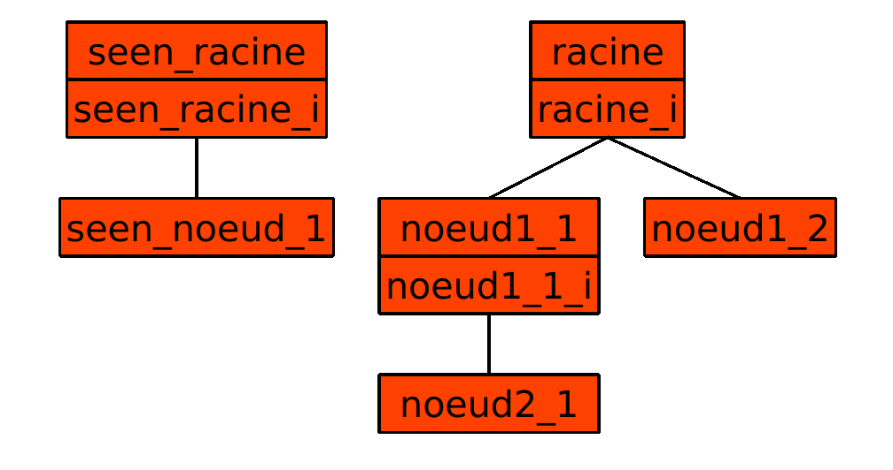

Par exemple :  
- b2rust appliqué à la machine noeud1_1 traduit les machines de son sous-arbre noeud1_1 et noeud2_1 mais pas les machines racine, noeud1_2.  
- Dans le cas où seen_racine est vu par une des machines de sous-arbre de noeud1_1, les machines seen_racine et seen_noeud sont également traduit.  


\newpage  


# Code B traduisible par b2rust 

b2rust ne traduit que l'**implementation** des machines et les **modules de bases**.  
Chaque machine est traduit en struct rust.  
Les concrete_variables et les machines référencés deviennent les champs du struct.  
Les concrete_constants deviennent les constantes statiques du struct.  
Les operations de la machine deviennent des methodes du struct.  
	

## Le typage
b2rust ne traduit que les concrete_constants et concrete_variables qu'on appelera données concretes.  
Chaque donnée doit être typé au moins une fois dans l’ensemble du module pour être traduit:  
- Les **constantes** doivent etre typé dans la clause **PROPERTIES**  
- Les **variables** doivent etre typé dans la clause **INVARIANT**  


Toutes les données concrètes d'identifiant 'ident' doivent etre typé en utilisant l'opérateur appartient '**:**' belongsTo de la forme :  

	ident : rust_type  

b2rust determine le type de la donné en fonction de l'identifiant de rust_type, pour simplifier il est preferable que toute les machines voient b2rust_types.mch qui fournissent déjà une bonne définition de chaque identifiant.  

Chaque donnée ne peut pas être typé plusieurs fois au sein d’une même machine, mais ils peuvent être typé différemment entre machines abstraite et ses raffinements. Seul le dernier typage est retenu pour b2rust.
 
###  Type atomique  


| Non terminal         | Productions                                |
|:----------------------:|:--------------------------------------------:|
| rust_integer         | ::= rust_signed_integer                     |
|                      |   \|  rust_unsigned_integer                  |
|----------------------|--------------------------------------------|
| rust_bool            | ::= TRUE                                   |
|                      |   \|  FALSE                                |
|----------------------|--------------------------------------------|
| rust_string          | ::= '"' .* '"'                           |


| Non terminal             | Productions                          |
|:--------------------------:|:--------------------------------------:|
| rust_signed_integer      | ::= rust_i8                           |
|                          |   \|rust_i16                        |
|                          |   \|rust_i32                        |
|                          |   \|rust_i64                        |
|                          |   \|rust_i128                        |
|--------------------------|--------------------------------------|
| rust_unsigned_integer      | ::= rust_u8                           |
|                          |   \|rust_u16                        |
|                          |   \|rust_u32                        |
|                          |   \|rust_u64                        |
|                          |   \|rust_u128                        |

Il faut noter que atelierB accepte le typage de string qu'en paremetre d'entrée d'opération.

Exemple d'un code B :

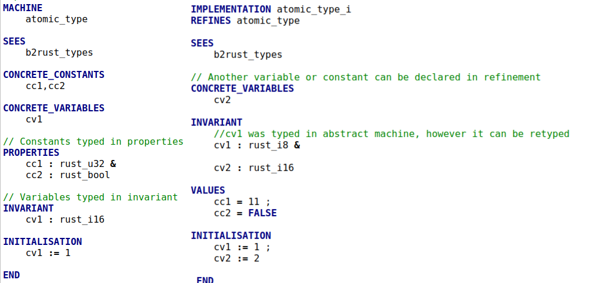


Et sa traduction en rust :

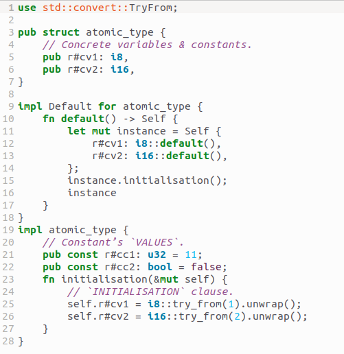{ width=50% }


### Type tableau

Les données concretes d'identifiant 'ident' destinés à être des tableaux doivent être typé de forme :

	ident : [interval "*"]+ interval --> rust_type
	
où :


| Non terminal             | Productions                          |
|:--------------------------:|:--------------------------------------:|
| interval                 | ::= 0..ExpressionArith               | 
|                          | \| rust_integer                      |
|--------------------------|--------------------------------------|
| rust_array                | ::= [interval "*"]+ interval "-->" rust_type| 
                

| Non terminal             | Productions                          |
|:--------------------------:|:--------------------------------------:|
| ExpressionArith    | ::= ExpressionArith "+" ExpressionArith           |
|                    | \| ExpressionArith "-" ExpressionArith            |
|                    | \| ExpressionArith "*" ExpressionArith            |
|                    | \| ExpressionArith "/" ExpressionArith            |
|                    | \| "(" ExpressionArith ")"                        |
|                    | \| ident                                           |
|                    | \| integer_literal                                 |

Remarque : b2rust n'est pas capable d'evaluer la valeur de la **borne sup** de l'interval. Par conséquent si l'interval est vide (ExpressionArith < 0) , b2rust ne va pas générer un tableau vide mais un 
tableau de taille negatif ce qui n'a aucun sens, l'erreur sera signalé à la compilation du code rust. De plus, la borne sup de l'intervalle n'a pas le droit d'être une concrete_variable.
(Cependant il est possible de créer un tableau vide avec l'intervalle 0..-1.)  


Exemple en B :

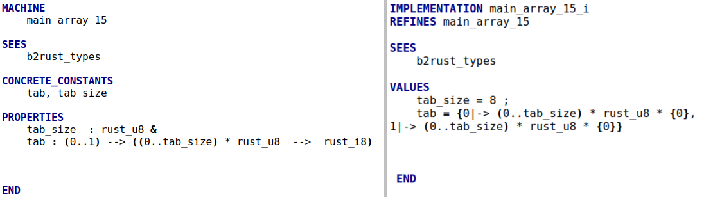

Et sa traduction en rust :

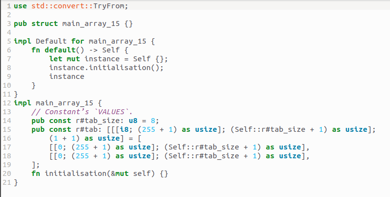{ width=80% }

	
### Set

Les set introduisent des **nouveaux types** reconnu par b2rust. Les sets seront traduit en **enumerations** rust.  
Pour chaque set d'identifiant set_ident et chaque donnée concrete d'identifiant ident, le typage :

	ident : set_ident 
	
est accepté dans b2rust


Exemple en B :

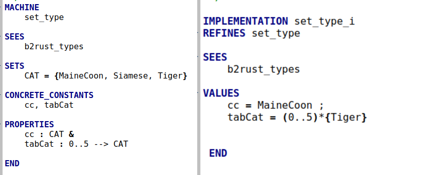

Et sa traduction en rust :

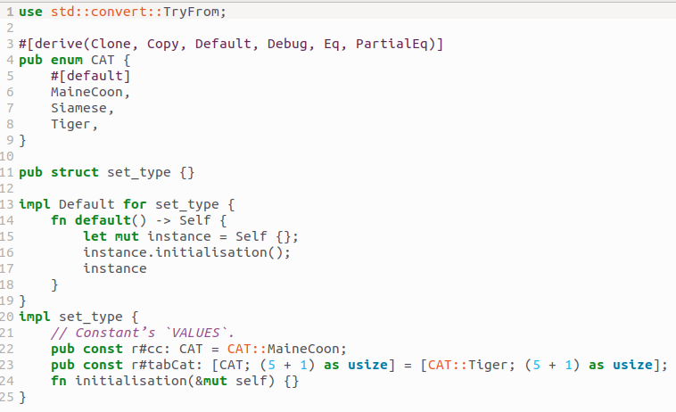{ width=80% }

### Conclusion et Extension

| Non terminal         | Productions                                |
|:----------------------:|:--------------------------------------------:|
|rust_type               | ::= rust_integer                         |
|                        | \|  rust_bool                         |
|                        | \|  rust_string                        |
|                        | \|  rust_array                       |
|                        | \|  set_ident                       |

Dans le cas où un type non-défini dans b2rust_types veut etre traduit comme étant un type de b2rust_types, il est possible d'etendre la synthaxe de typage en ajoutant des associations dans le fichier
'b2rust_types.cfg'. Par exemple : l'utilisateur a défini uint8_t de C dans une machine B. Il souhaite que b2rust traduit 
```
	vv : uint8_t
```

en 
```
	vv : u8 
```

Il suffit qu'il ajoute la paire ' uint8_t rust_u8' dans b2rust_types.cfg.

[Voir un exemple ]{#cfg_example}


## Les operations

### Parametres

Tout les paramètres d'**entrées** et **sorties** des opérations doivent être typé une et une seule fois dans la **precondition** de l'**abstraction**.  
Si l'operation n'a aucun paramètres, il n'est pas necessaire de commencer l'operation par un 'PRE'.  


Exemple en B :

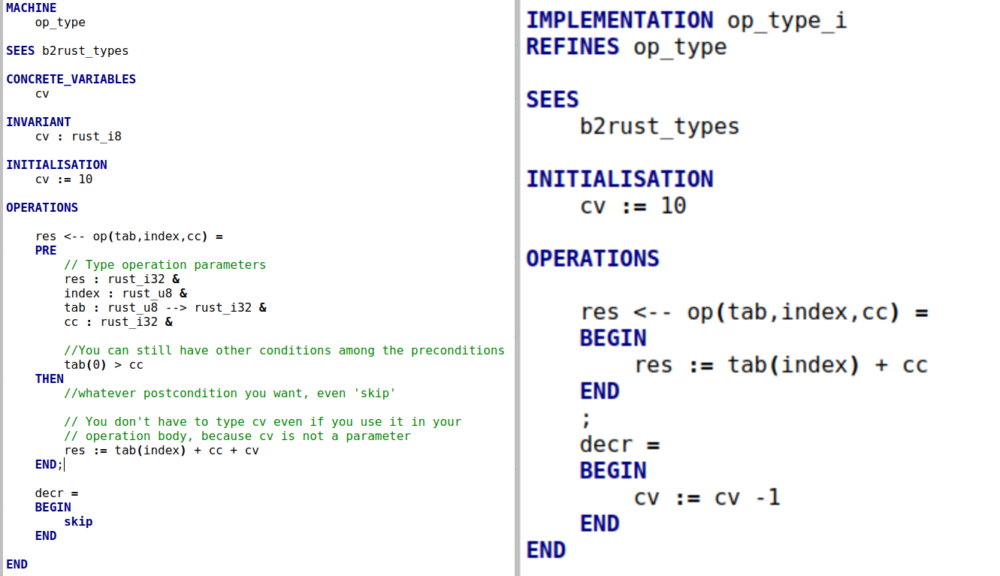

Et sa traduction en rust :

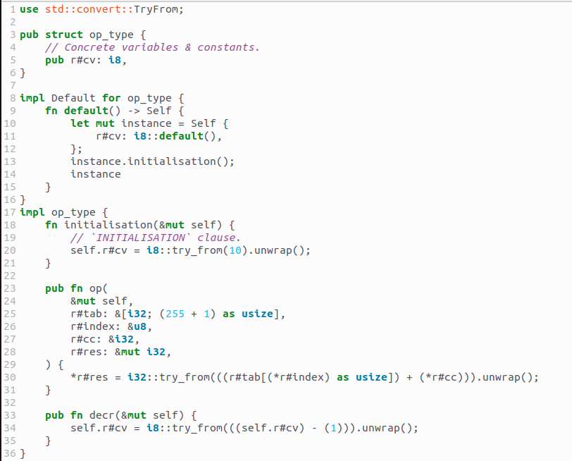{ width=80% }


### Variables locales 
	
Les variables locales dans l'implementation doivent etre typé avec l'operateur **vv::E** BecomesIn ou **vv:(vv:E)** BecomesSuchThat dans les premieres instructions apres avoir été declarés.  

Exemple en B :

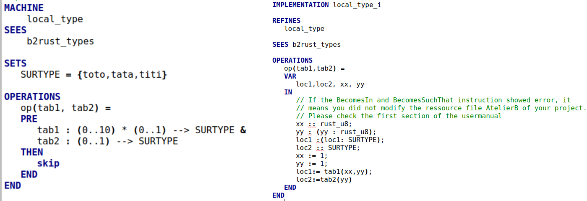

Et sa traduction en rust :

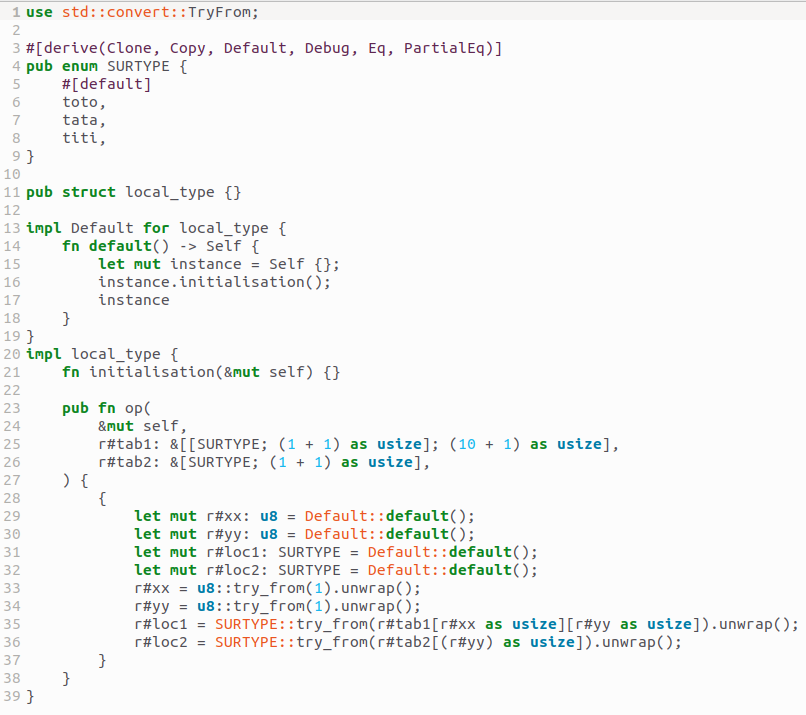{ width=80% }


## Expressions 

| Non terminal        | Productions                                    |
|:---------------------:|:--------------------------------------------:|
| Expression             | ::= ExpressionArith                         |
|                        | \| ExpressionTableau                        |
|                        | \| ExpressionBoolenne                       |
|                        | \| TermeSimple                              |

SetElement désigne les elements des sets déclarés.    

| Non terminal        | Productions                                    |
|:---------------------:|:--------------------------------------------:|
| Expression_booléenne  | ::= Booléen_lit                         |
| 			| \| "bool""(" Condition ")"                          |

| Non terminal        | Productions                                    |
|:---------------------:|:--------------------------------------------:|
| TermeSimple             | ::= Iden_ren                         |
|                        | \| IntegerLitteral                               |
|                        | \| BooleanLiteral                               |
|                        | \| "bool""(" Condition ")"                               |


### Expressions arithmetiques

#### Lambda fonctions 

Rust impose deux contraintes pour les expressions arithmétiques :  
- **Compilation** : Les opérandes doivent avoir le même type rust, à l'exception du :  
	- **left-shift** : la seconde opérande doit être de type **rust_unsigned_integer**  
	- **right-shift** :  la seconde opérande doit être de type **rust_unsigned_integer**  
	- **exponentiation** : la seconde opérande doit être de type **u32**  
- **Exécution** : Rust panique à l'exécution lorsqu'il y'a un **overflow** ( bien qu'il y'a des options pour désactiver ceci ).    
b2rust a choisi de respecter le choix de rust.    
Pour controler qu'il n'y'a pas d'overflow dans atelierB, des lambdas fonctions ont été fourni dans 'b2rust_types.mch' afin de modeliser des opérateurs arithmetiques.  


| Non terminal        | Productions                                      |
|:---------------------:|:--------------------------------------------:|
| ExpressionArith | ::= ExpressionArith "+" ExpressionArith      |
|                 | \| ExpressionArith "-" ExpressionArith       |
|                 | \| ExpressionArith "*" ExpressionArith       |
|                 | \| ExpressionArith "/" ExpressionArith       |
|                 | \| ExpressionArith "mod" ExpressionArith       |
|                 | \| ExpressionArith "**" ExpressionArith      |
|                 | \| - (ExpressionArith)                       |
|                 | \| add "_" dom "(" ExpressionArith "," ExpressionArith ")"|
|                 | \| sub "_" dom "(" ExpressionArith "," ExpressionArith ")"|
|                 | \| mul "_" dom "(" ExpressionArith "," ExpressionArith ")"|
|                 | \| div "_" dom "(" ExpressionArith "," ExpressionArith ")"|
|                 | \| mod "_" dom "(" ExpressionArith "," ExpressionArith ")"|
|                 | \| pow "_" dom "(" ExpressionArith "," ExpressionArith ")"|
|                 | \| lshift "_" dom "(" ExpressionArith "," ExpressionArith ")"|
|                 | \| rshift "_" dom "(" ExpressionArith "," ExpressionArith ")"|
|                 | \| and "_" dom "(" ExpressionArith "," ExpressionArith ")"|
|                 | \| or "_" dom "(" ExpressionArith "," ExpressionArith ")"|
|                 | \| xor "_" dom "(" ExpressionArith "," ExpressionArith ")"|
|                 | \| "(" ExpressionArith ")"                   |
|                 | \| ident                                     |
|                 | \| integer_literal                           |
|-----------------|----------------------------------------------|
| dom 	          | ::= "i8"                                     |
|		  | \| "i16"	                                 |
|		  | \| "i32"	                                 |
|		  | \| "i64"	                                 |
|		  | \| "i128"	                                 |
|		  | \| "u8"	                                 |
|		  | \| "i16"	                                 |
|		  | \| "i32"	                                 |
|		  | \| "i64"	                                 |
|		  | \| "i128"	                                 |

  
Ces lambdas fonctions ont la particularité de :  
1) générer des **obligations de preuve** sur le type des opérandes ainsi sur le type du resultat  
2) faire la **conversion** des opérandes vers le type resultat (justifié si code prouvé).  

L'intérêt de faire la conversion c'est qu'il serait possible de faire une opération avec deux opérandes de type différent (mais compatible).

En résumé,

\newpage

|Operandes       | Code B          | Code Rust traduit                                    | Résultat       |
|:--------------:|:---------------:|:----------------------------------------------------:|:--------------:|
| aa :i8 = 120   | aa + bb         | aa + bb                                              |   OK           |
| bb :i8 = 7     |	           |                                                      |                |
|----------------|-----------------|------------------------------------------------------|----------------|
| aa :i8 = 120   | aa + bb         |   aa + bb                                            |   compile error|
| bb :u8 = 7     |	           |                                                      | (not same type) |
|----------------|-----------------|------------------------------------------------------|----------------|
| aa :i8 = 120   |add_i8(aa,bb)    |i8::try_into(aa).unwrap() +                           |   OK          |
| bb :u8 = 7     |	           |i8::try_into(bb).unwrap()                             |                |
|----------------|-----------------|------------------------------------------------------|----------------|
| aa :i16 = 128  | pow_i8(aa,bb)   | (i8::try_into(aa).unwrap())                          | panic           |
| bb :u8 = 7     |	           | .pow(bb as u32)                                      |(conversion failed)|
|----------------|-----------------|------------------------------------------------------|----------------|
| aa :i16 = 128  |lshift_u32(aa,bb)|  u32::try_into(aa).unwrap() >>                       | OK             |
| bb :i8 = 2     |	           |  b as usize                                          |                |
	

#### Conversion 

b2rust utilise deux types de conversions:  
- 'as type' s'agit d'une conversion explicite, c'est à dire une réinterpretation bit à bit **sans verification**.  
- 'type::try_into(ident).unwrap()' s'agit d'une conversion **avec verification**, rust panique si la conversion echoue.  

b2rust ajoute systématiquement les conversions avec vérification lorsque les lambdas fonctions sont utilisé à l'exception des cas suivants:  
- Clause VALUES  
- Deuxieme argument de l'exponentiation  
- Deuxieme argument du left shift  
- Deuxieme argument du right shift  

Ce sera la conversion explicite 'as' qui sera utilisé.  Le danger d'utiliser 'as' c'est que rust ne panique pas si la conversion echoue.

Par exemple : 

	let aa : i16 = 128     
	let bb : i8 = aa as i8 // bb vaut -128
	
Il est donc très recommandé de valider les obligations de preuve avant de traduire afin de prevenir ce genre de situation.	

#### Extension {#extend1}

Dans le cas où une lambda fonction non-défini dans 'b2rust_types.mch' veut etre traduit comme étant une lambda fonction de b2rust_types, il est possible d'etendre la synthaxe de typage en ajoutant des associations dans le fichier 'b2rust_operations.cfg'. Par exemple : l'utilisateur a défini bitwise_and de C dans une machine B. Il souhaite que b2rust traduit 
```
	bitwise_and_uint32(aa,bb)
```

en 
```
	aa ^ bb //à conversion près 
```

Il suffit qu'il ajoute la paire ' bitwise_and_uint32 and_u32' dans b2rust_operations.cfg.

[Voir un exemple ]{#cfg_example}  

### Expression Tableau

| Non terminal        | Productions                                      |
|:---------------------:|:--------------------------------------------:|
| ExpressionTableau | ::= "{" (integer_litteral "|->" Expression)+, "}" |
|                   | \| (interval)+* interval * "{" ExpressionArith "}"|
|                   | \| (interval)+* interval * "{" ExpressionBooleenne "}"|
|                   | \| (interval)+* interval * "{" TermeSimple "}"|
|                   | \| ident                                          |

Il faut noter que integer_litteral doit etre positive.

## Instructions 

Les instructions B0 sont traduisible.


### Affectation

Lors d'une affectation de la forme :

	ident := Expression
	
b2rust ajoute automatiquement des conversions avec verification'try_into(_).unwrap()' pour convertir le type de l'expression vers le type de ident.  
Cette conversion est utile dans le cas où l'expression a un type **compatible** mais non identique à l'ident.

Exemple en B :

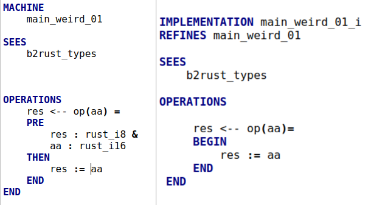{ width=80% }

Et sa traduction en rust :

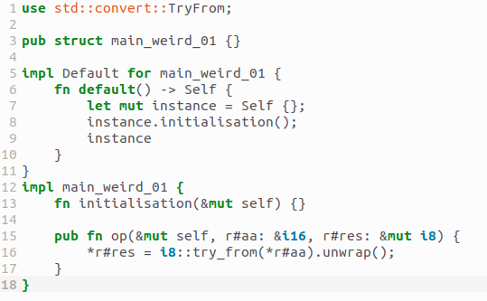{ width=80% }

**Exception** : Il n'est pas possible de faire des conversions concernant les types **tableaux** ( mais element des tableaux c'est accepté)
 
Si la conversion echoue, rust panique à l'execution. Pour eviter cette situation, des lambdas fonctions fit (identité sur un domaine) sont proposés, lors de chaque affectation il est recommandé d'utilisé fit pour assurer que l'affectant a un type compatible avec l'affectable.

b2rust ignore les lambdas function fit , par exemple :

	ident := fit_i8(Expression)

est traduit en 

	ident = Expression //à conversion près 
	
La synthaxe du fit peut être également étendu, comme les opérations.
[Voir comment etendre la synthaxe des opérations](#extend1)

### Appel de fonction

Pas de contraintes en particulier, il s'agit juste d'expliquer comment l'appel de fonction est traduit.  
L'idée est simple:  
1) copier les parametres d'entrée et de sortie  
2) faire un appel de fonction sur ces copies  
3) modifier les parametres de sorties avec la copie modifiée  

Il s'agit d'un mécanisme pour contourner le problème d'emprunt en rust.

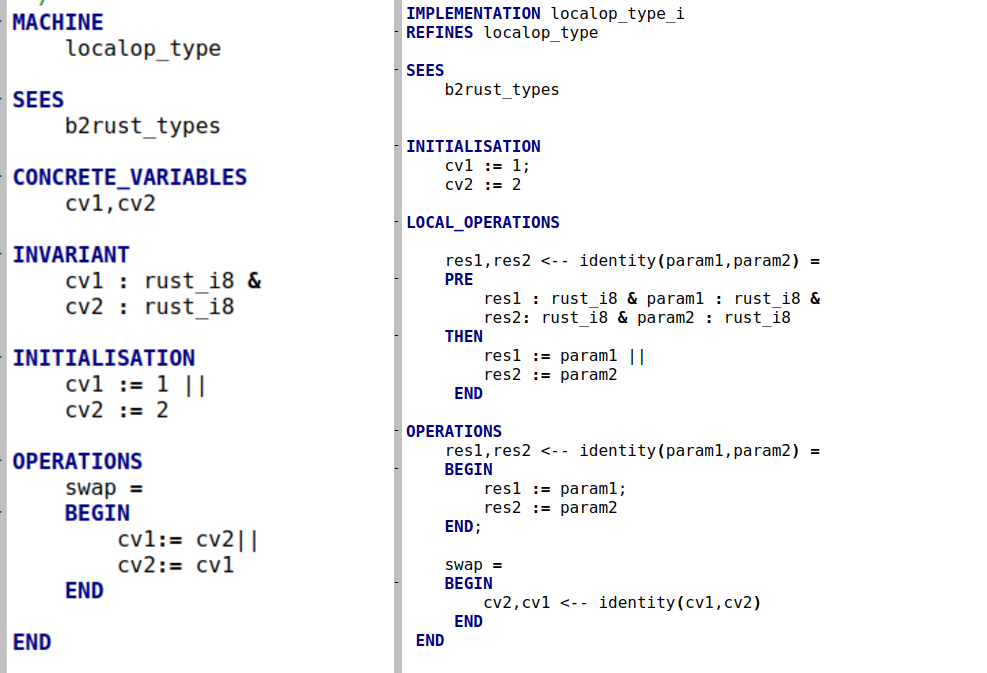{ width=100% }

Et sa traduction en rust :

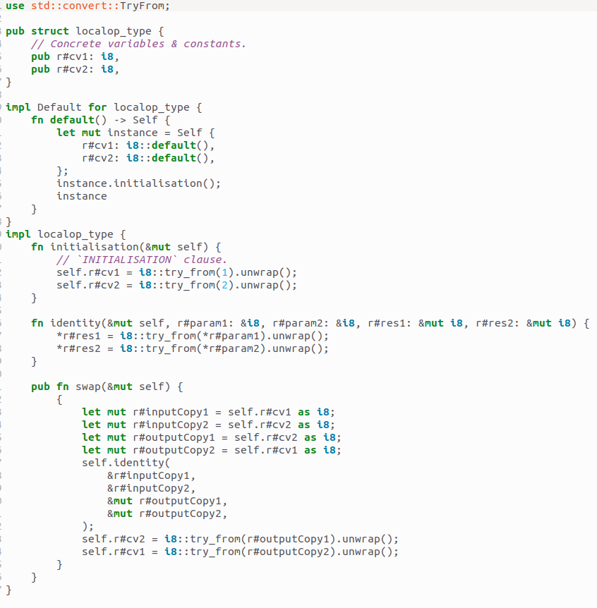{ width=100% }


## Machine Referencées

| Non terminal        | Productions                                     |
|:---------------------:|:--------------------------------------------:|
| Clause_imports        | ::= "IMPORTS" ( (Ident_ren "["(" Instanciation +",")]")+  )|
| Clause_sees           | ::= "SEES" Ident_ren+ 				|
| Clause_extends       | ::= EXTENDS" ( Ident [ "(" Instanciation +",") ]+",")+","   ")" ] )

Toute les machines références deviennent les champs du struct. A savoir les machines **importés**, **vus** et **etendus**.

Exemple en B :

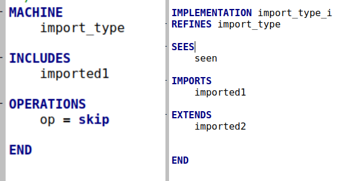{ width=80% }

Et sa traduction en rust :

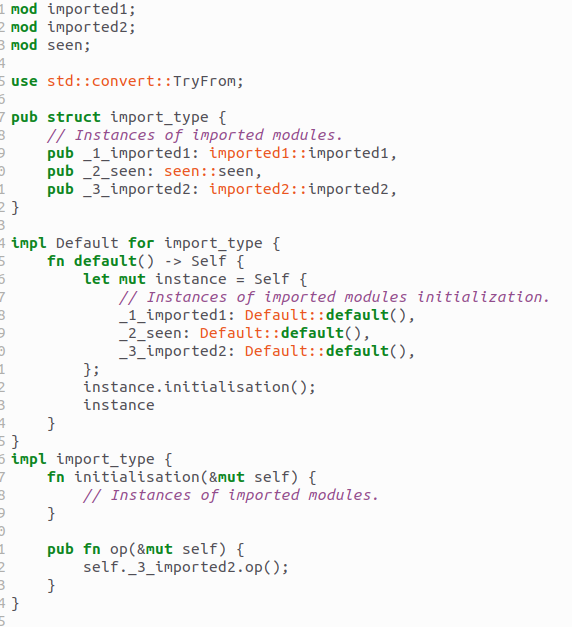{ width=80% }
	
### Parametres formelles
	
| Non terminal        | Productions                                     |
|:---------------------:|:--------------------------------------------:|
| Instanciation         | ::= TermeSimple 				|
|                       | \|  ExpressionArith 				|
|                       | \|  ExpressionBoolean 				|


Les parametres formelles de la machine doivent être **typé** dans la clause **INVARIANT**.
Le renommage est accepté à condition de n'avoir qu'un préfixe de renommage.  

Dans cette version d'atelierB, il y'a deux problemes :  
- Il y'a encore des bugs sur les multiples préfixes de renommage d'atelierB.   
- La clause SEES dans atelierB ne peut pas faire vraiment référence à une instance d'importation

Le choix de traduction adopté pour les parametres formelles est d'ajouter un **champ privé** dans le struct Rust.  
Puis ajouter un constructeur nommé **new** en plus du constructeur par défaut.   
L'instanciation des machines ayant des parametres se fera avec new.  

Exemple en B :

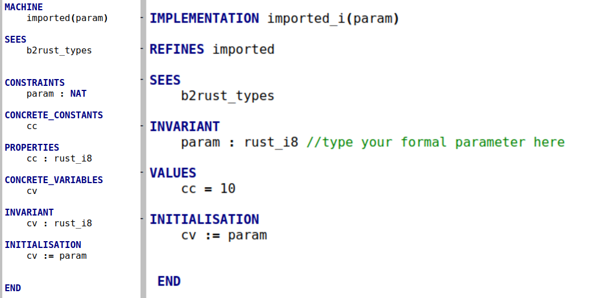{ width=100% }

Et sa traduction en rust :

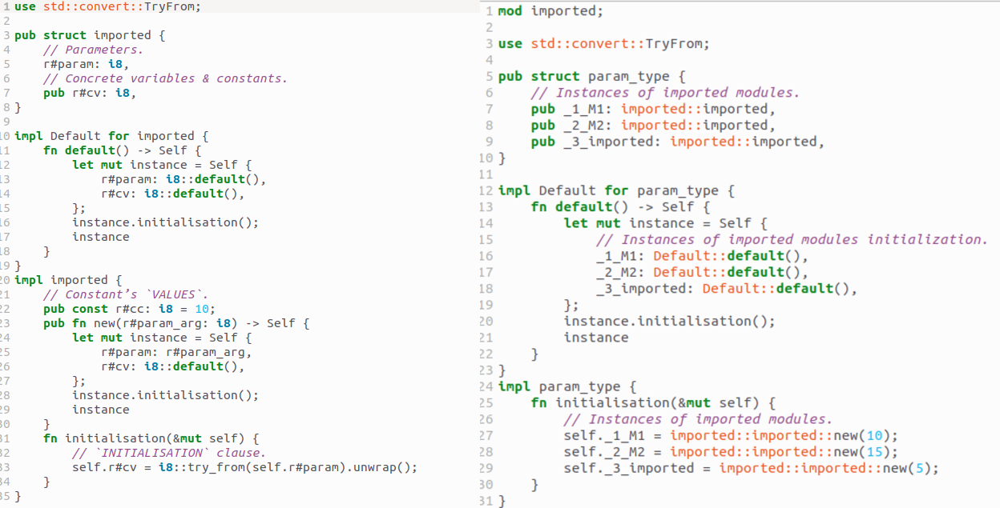{ width=100% }

### Module de base

Concernant les machines qui n'ont pas d'implementation, b2rust génere un fichier d'extension '.rs.template' qui servira de **modèle**.  

Dans le contenue du modèle :  
- Les concrete_variables parfois traduit, les concrete_constants parfois traduit et toujours commenté.
- Les instructions traduisible dans l'initialisation sont parfois traduit  
- La signature des opérations sont **traduite**, mais le corps de la méthode est suivi d'un macro **unimplemented!**

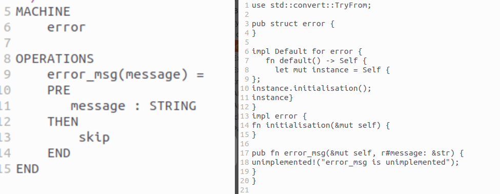{ width=100% }

Un fichier bash **check.sh**  est fourni  pour verifier que l'utilisateur a bien implementé le struct et les méthodes associées. 


### Fichier non destiné à être traduit {#cfg_example}

Il peut exister des machines B dont le seul but est de servir de **bibliothèque** pour fournir des informations de typage et lambdas fonctions.  
Ces machines là n'ont pas vocation à etre traduit mais à générer des obligations de preuves, comme par exemple le 'b2rust_types.mch'.  
Pour gérer ce type de fichier, b2rust fournit un fichier de configuration 'b2rust_exceptions.cfg', les machines se trouvant à l'intérieur de fichier ne sera pas **vu** dans la traduction par les autres machines ( ne devient pas des champs du struct).  
Cependant chaque type référencé de la bibliotheque qui doivent etre traduit doivent avoir une association dans b2rust_types.cfg
Chaque lambdas fonctions utilisés doivent avoir une association dans b2rust_operations.cfg

Exemple en B :

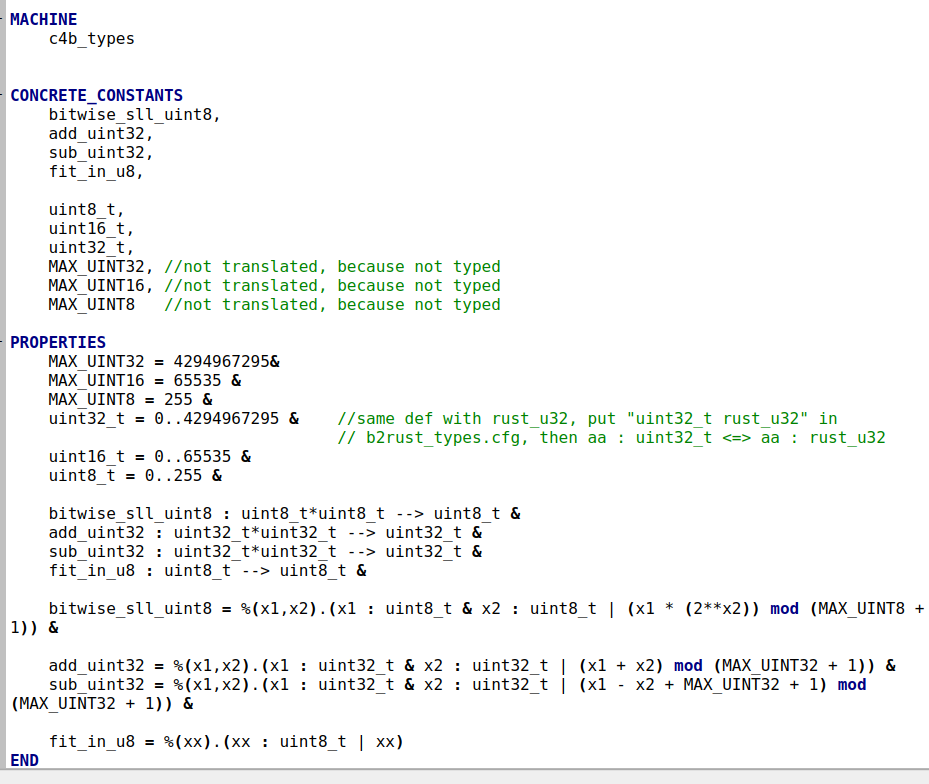{ width=100% }

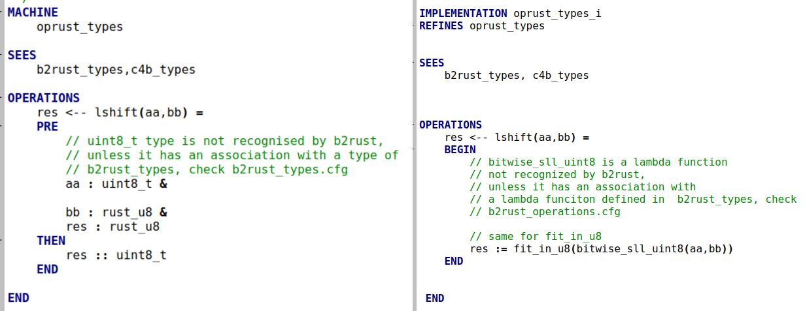{ width=100% }

Et sa traduction en rust :

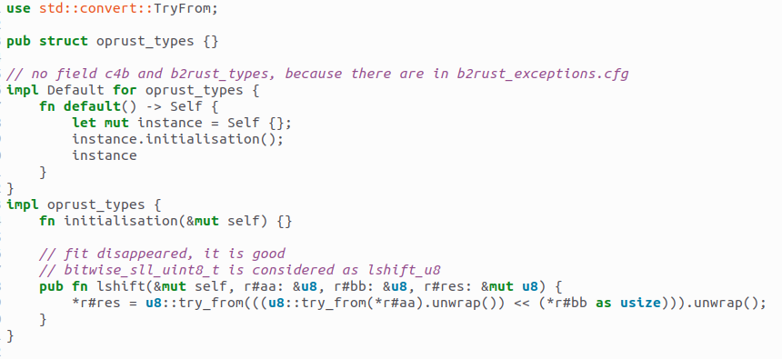{ width=100% }


Un Warning sera déclenché si b2rust ne reconnait pas l'information de typage d'une donnée concrete.


# Conclusion


Pour que b2rust génère du code, il faut se poser les questions : 
- Est ce que tout les concrete_constants, concrete_variables sont bien typés dans la bonne clause ?
- Est ce que toute les opérations ont leurs parametres d'entrée et sortie bien typés dans la précondition de la machine abstraite ? 
- Est ce que les variables locales sont typés avec des BecomesIn ou BecomesSuchThat ? 
- Est ce que les associations entre mes types et mes lambdas fonction avec ceux de b2rust_types sont bien fait ? 


	


