---
title: "b2rust "
date: "2023-07-17"
doccode: "C_D270"
version: "v01.00"
subtitle: "User Manual"
author: "Christophe CHEN"
colorlinks: true
header-includes:
- |
  ```{=latex}
  \usepackage{awesomebox}
  \usepackage[utf8]{inputenc}
  \usepackage[french]{babel}
  ```
pandoc-latex-environment:
  importantblock: [requirement]
  noteblock: [note]

...
# Introduction

This document serves as a **user manual** for b2rust. It presents its **constrains on use** and the **translation choices** of B models to Rust.  

# Run b2rust

## Configuration

### Resource file

Add the following lines to your project's **AtelierB** resource file:  

        ATB*BCOMP*Allow_Becomes_Member_Of:TRUE  
        ATB*BCOMP*Allow_Becomes_Such_That:TRUE  
        ATB*TC*Allow_Becomes_Member_Of:TRUE  
        ATB*TC*Allow_Becomes_Such_That:TRUE  
	

These lines are needed to generate **bxml** for implementations that use the following instructions:  
- **vv :: E** (Becomes in)  
- **vv : (vv : E)** (Becomes such that)  

### Configuration files

b2rust needs to know the directory where its three configuration files are located:  
-**b2rust_types.cfg**  
-**b2rust_operations.cfg**  
-**b2rust_exceptions.cfg**.  

By default, these three configuration files are present in the **files** directory of b2rust. Execute the command: :

	export B2RUST_CONF_HOME=~/path/to/b2rust/files  

If you need to modify the b2rust configuration, you can copy the template of these files and edit them in another directory. Remember to update the path.

## Code generation

### BXML generation

b2rust actually translates the 'bxml'. A script file named 'gen_bxml.sh' is provided to create the bxml from the **mch**, **ref**, and **imp** extension files. 

To run this script, it is recommended to add the path to the bxml **executable** from AtelierB to the native library :  

	export LD_LIBRARY_PATH=/path/to/atelierB/bbin/linux_x64/:$LD_LIBRARY_PATH   

Now, the **gen_bxml** script :

	sh gen_bxml.sh $1 $2 $3   

- **$1** : the path to the directory containing the bxml **executable** from AtelierB  
- **$2** : the target directory containing the files for which you want to generate the 'bxml`  
- **$3** : the AtelierB resource file 

### Génération du code Rust

After generating the bxml, b2rust is capable of translating B models. 

To translate a B machine, use the following command :  

	./b2rust  $1 -I $2 [-O $3]   

- **$1** : the name of the machine you want to translate.
- **$2** : the target directory
- **$3** : the directory where b2rust generates the translation (optional)


This command also recursively translates all machines that are seen, imported, and extended by the implementation machine (or base module).

\newpage 

__Example__ :

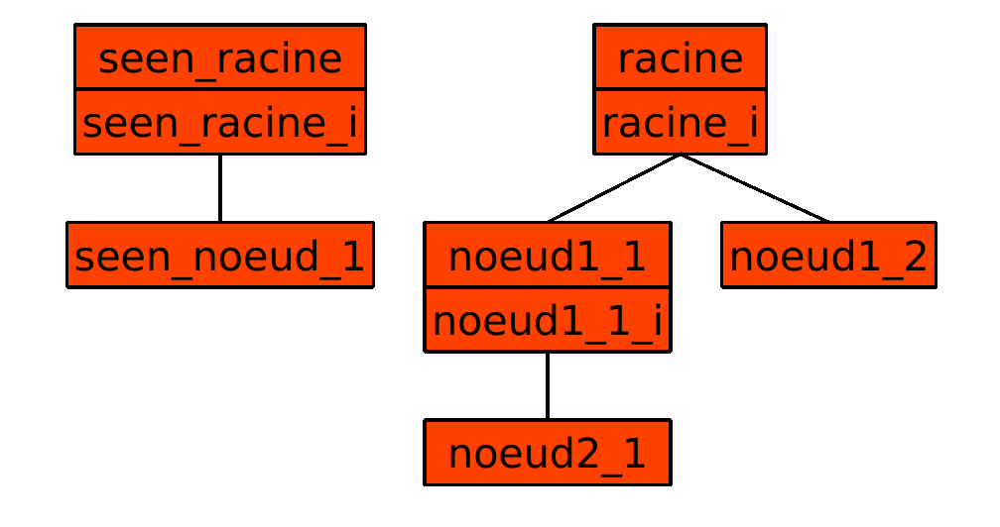
 
- Applying b2rust to the machine "noeud1_1" translates the machines in its subtree "noeud1_1" and "noeud2_1", but not the root machines "noeud1_2".  
- If "seen_racine" is seen by a machine in the subtree of "noeud1_1", then the machines "seen_racine" and "seen_noeud" are also translated.  


\newpage  


# B0 in b2rust

b2rust translates only the **implementation** of machines and the **basic modules**.  
Generally, the translation pattern is :  
- Each **machine** is translated into a rust **struct**.  
- Concrete_variables and Referenced machines become struct fields.  
- Concrete_constants become the struct's static constants.  
- Machine operations become struct methods.  
	

## Typing

b2rust only translates concrete_constants and concrete_variables (concrete data).  
Each concrete data must be typed at least once in the module in order to be translated:  
- **Constants** must be typed in the **PROPERTIES** clause.  
- **Variables** must be typed in the **INVARIANT** clause.  

Every concrete data that has 'ident' as identifiant must be typed using the BelongTo operator'**:**' :  

	ident : rust_type  

b2rust determines the data type according to the rust_type **identifier**.  
To make things easy, all machines should **see** b2rust_types.mch, which already provides a good definition of each identifier.  

Each concrete date cannot be typed several times within the same machine, but they can be typed **differently** between abstract machines and their refinements.  
Only the **latter** matters for b2rust.

\newpage 

### Atomic type


| Non terminal         | Productions                                |
|:----------------------:|:--------------------------------------------:|
| rust_integer         | ::= rust_signed_integer                     |
|                      |   \|  rust_unsigned_integer                  |
|----------------------|--------------------------------------------|
| rust_bool            | ::= TRUE                                   |
|                      |   \|  FALSE                                |
|----------------------|--------------------------------------------|
| rust_string          | ::= '"' .* '"'                           |


| Non terminal             | Productions                          |
|:--------------------------:|:--------------------------------------:|
| rust_signed_integer      | ::= rust_i8                           |
|                          |   \|rust_i16                        |
|                          |   \|rust_i32                        |
|                          |   \|rust_i64                        |
|                          |   \|rust_i128                        |
|--------------------------|--------------------------------------|
| rust_unsigned_integer      | ::= rust_u8                           |
|                          |   \|rust_u16                        |
|                          |   \|rust_u32                        |
|                          |   \|rust_u64                        |
|                          |   \|rust_u128                        |

Note that in AtelierB, STRING type is exclusive to operation parameters.  
[Click here to see an example of STRING type use](#base_mod)

\newpage

__B code example__ :


__Its translation into rust__ :

{ width=50% }


### Tabular type

Every concrete data that has 'ident' as identifiant intended to be arrays must be typed as :

	ident : [interval "*"]+ interval --> rust_type
	
while :


| Non terminal             | Productions                          |
|:--------------------------:|:--------------------------------------:|
| interval                 | ::= 0..ExpressionArith               | 
|                          | \| rust_integer                      |
|--------------------------|--------------------------------------|
| rust_array                | ::= [interval "*"]+ interval "-->" rust_type| 
                

[See the definition of Expression Arith](#ExprArith)

Note: b2rust is not able to interpret the **supremum** of the interval. Therefore, if the interval is empty (ExpressionArith < 0), b2rust will not generate an empty array, but negative size array, which makes no sense, and the error will be told at compilation.  
In addition, the upper bound of the interval is not allowed to be a concrete_variable.
(However, it is possible to create an empty array with the interval 0..-1)

\newpage 

__B code example__ :

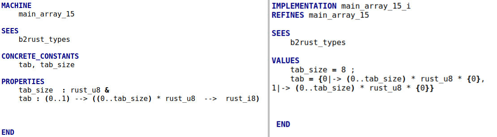

__Its translation into rust__ :

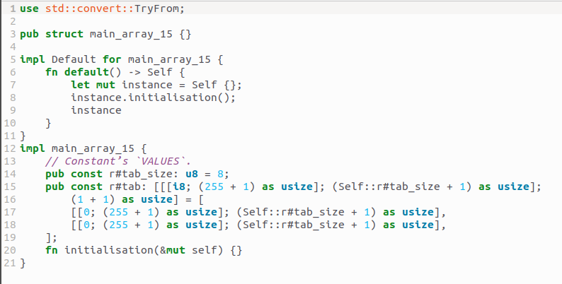{ width=80% }

\newpage

### Set

Sets introduce **new types** recognized by b2rust. Sets will be translated into rust **enumerations**. 
For each set that has 'set_ident' as identifier and each concrete data that has 'ident' as identifier, the typing 

	ident : set_ident 
	
is accepted in b2rust.

\newpage 

__B code example__:


__Its translation into rust__ :

{ width=80% }

\newpage

### Conclusion et Extension

| Non terminal         | Productions                                |
|:----------------------:|:--------------------------------------------:|
|rust_type               | ::= rust_integer                         |
|                        | \|  rust_bool                         |
|                        | \|  rust_string                        |
|                        | \|  rust_array                       |
|                        | \|  set_ident                       |

In the case where a type not defined in b2rust_types wants to be translated as a type of b2rust_types, it is possible to extend the syntax by adding associations in the file 'b2rust_types.cfg' file. For example: the user has defined uint8_t of C in B machine. He would like b2rust to translate 

```
	vv : uint8_t
```

into 
```
	vv : u8 
```

He just have to add the pair ' uint8_t rust_u8' in b2rust_types.cfg.

[See an example ](#cfg_example)


\newpage

## Operations

### Parameters

All **input** and **output** operation parameters must be typed once and only once in the **precondition** of the **abstraction**.  
If the operation has no parameters, there is no need to start the operation with a 'PRE'. 


__B code example__ :  


__Its translation into rust__ :  

{ width=80% }


### Local variables
	
Local variables in implementation must be typed with the **vv::E** BecomesIn or **vv:(vv:E)** BecomesSuchThat operator in the first instructions after being declared.  

\newpage

__B code example__ : 

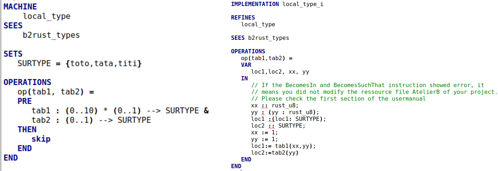

__Its translation into rust__ : 

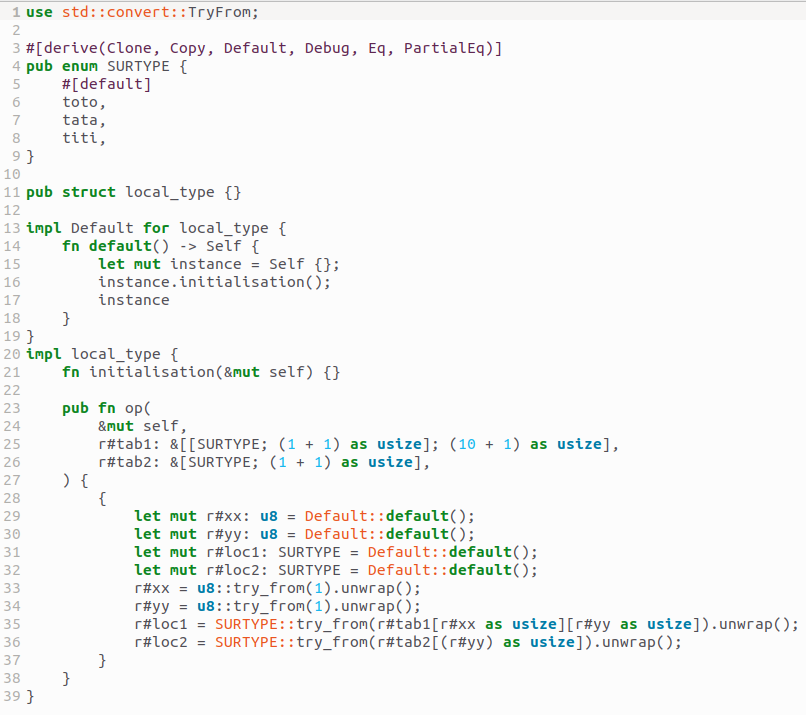{ width=80% }


## Expressions 

| Non terminal        | Productions                                    |
|:---------------------:|:--------------------------------------------:|
| Expression             | ::= ExpressionArith                         |
|                        | \| ExpressionTabular                      |
|                        | \| ExpressionBoolean                       |
|                        | \| TermeSimple                              |


| Non terminal        | Productions                                    |
|:---------------------:|:--------------------------------------------:|
| ExpressionBoolean  | ::= BooleanLiteral                         |
| 			| \| "bool""(" Condition ")"                          |

| Non terminal        | Productions                                    |
|:---------------------:|:--------------------------------------------:|
| TermeSimple             | ::= Iden_ren                         |
|                        | \| IntegerLitteral                               |
|                        | \| BooleanLiteral                               |
|                        | \| "bool""(" Condition ")"                               |
|                        | \| SetElement                              |

SetElement refers to the declared sets's elements. 

\newpage 

### Arithmetic expressions {#ExprArith}

#### Lambda functions   

Rust has two constraints for arithmetic expressions:  
- **Compilation**: Operands must have the same rust type, with the exception of :  
	+ **left-shift**: the second operand must be of **rust_unsigned_integer** type.  
	+ **right-shift**: the second operand must be of **rust_unsigned_integer** type  
	+ **exponentiation** : the second operand must be of **u32** type.  
- **Execution** : Rust panics at execution when there is an **overflow** (although there are options to disable this).    

b2rust respect rust's choice.    
To check that there is no overflow in AtelierB, lambdas functions have been provided in 'b2rust_types.mch' to modeling arithmetic operators.  


| Non terminal        | Productions                                      |
|:---------------------:|:--------------------------------------------:|
| ExpressionArith | ::= ExpressionArith "+" ExpressionArith      |
|                 | \| ExpressionArith "-" ExpressionArith       |
|                 | \| ExpressionArith "*" ExpressionArith       |
|                 | \| ExpressionArith "/" ExpressionArith       |
|                 | \| ExpressionArith "mod" ExpressionArith       |
|                 | \| ExpressionArith "**" ExpressionArith      |
|                 | \| - (ExpressionArith)                       |
|                 | \| add "_" dom "(" ExpressionArith "," ExpressionArith ")"|
|                 | \| sub "_" dom "(" ExpressionArith "," ExpressionArith ")"|
|                 | \| mul "_" dom "(" ExpressionArith "," ExpressionArith ")"|
|                 | \| div "_" dom "(" ExpressionArith "," ExpressionArith ")"|
|                 | \| mod "_" dom "(" ExpressionArith "," ExpressionArith ")"|
|                 | \| pow "_" dom "(" ExpressionArith "," ExpressionArith ")"|
|                 | \| lshift "_" dom "(" ExpressionArith "," ExpressionArith ")"|
|                 | \| rshift "_" dom "(" ExpressionArith "," ExpressionArith ")"|
|                 | \| and "_" dom "(" ExpressionArith "," ExpressionArith ")"|
|                 | \| or "_" dom "(" ExpressionArith "," ExpressionArith ")"|
|                 | \| xor "_" dom "(" ExpressionArith "," ExpressionArith ")"|
|                 | \| "(" ExpressionArith ")"                   |
|                 | \| ident                                     |
|                 | \| integer_literal                           |
|-----------------|----------------------------------------------|
| dom 	          | ::= "i8"                                     |
|		  | \| "i16"	                                 |
|		  | \| "i32"	                                 |
|		  | \| "i64"	                                 |
|		  | \| "i128"	                                 |
|		  | \| "u8"	                                 |
|		  | \| "i16"	                                 |
|		  | \| "i32"	                                 |
|		  | \| "i64"	                                 |
|		  | \| "i128"	                                 |

  
These lambdas functions have the particular feature of :  
1) generate **proof obligations** on the operand type as well as on the result type  
2) perform **conversion** of operands to result type ( justified if code has been proven).  

The advantage of conversion is that it would be possible to perform an operation with two operands of different (but compatible) type.

\newpage

To summarize,


|Operand s       |  B Code         |  Translated Rust Code                                | Result       |
|:--------------:|:---------------:|:----------------------------------------------------:|:--------------:|
| aa :i8 = 120   | aa + bb         | aa + bb                                              |   OK           |
| bb :i8 = 7     |	           |                                                      |                |
|----------------|-----------------|------------------------------------------------------|----------------|
| aa :i8 = 120   | aa + bb         |   aa + bb                                            |   compile error|
| bb :u8 = 7     |	           |                                                      | (not same type) |
|----------------|-----------------|------------------------------------------------------|----------------|
| aa :i8 = 120   |add_i8(aa,bb)    |i8::try_into(aa).unwrap() +                           |   OK          |
| bb :u8 = 7     |	           |i8::try_into(bb).unwrap()                             |                |
|----------------|-----------------|------------------------------------------------------|----------------|
| aa :i16 = 128  | pow_i8(aa,bb)   | (i8::try_into(aa).unwrap())                          | panic           |
| bb :u8 = 7     |	           | .pow(bb as u32)                                      |(conversion failed)|
|----------------|-----------------|------------------------------------------------------|----------------|
| aa :i16 = 128  |lshift_u32(aa,bb)|  u32::try_into(aa).unwrap() >>                       | OK             |
| bb :i8 = 2     |	           |  b as usize                                          |                |
	
\newpage

#### Conversion  

\ 

b2rust uses two types of conversion:  
- 'as type' is an explicit conversion, i.e. a bit-by-bit reinterpretation **without verification**.  
- 'type::try_into(ident).unwrap()' is a conversion **with verification**, rust panics if the conversion fails.  

b2rust always adds conversions with verification when lambda functions are used, except in the following cases:  
- VALUES clause  
- Second argument of exponentiation  
- Second argument of left shift  
- Second argument of right shift   

The explicit conversion 'as' will be used.  The danger of using 'as' is that rust doesn't panic if the conversion fails.

For example: 

	let aa : i16 = 128     
	let bb : i8 = aa as i8 // bb is -128  

Therefore it is highly recommended to validate proof obligations before translating to prevent this kind of situation.		

#### Extension {#extend1}  

\ 

In the case where a lambda function not defined in b2rust_types wants to be translated as a lambda function of b2rust_types, it is possible to extend the syntax by adding associations in the file 'b2rust_operations.cfg' file. For example: the user has defined bitwise_and_uint32 of C in B machine. He would like b2rust to translate 

```
	bitwise_and_uint32(aa,bb)
```

into  
```
	aa ^ bb //à conversion près 
```

He just have to add the pair ' bitwise_and_uint32 and_u32' in b2rust_operations.cfg.

[See an example ](#cfg_example)

\newpage


### Tabular Expression

| Non terminal        | Productions                                      |
|:---------------------:|:--------------------------------------------:|
| ExpressionTabular | ::= "{" (IntegerLitteral "\|->" Expression)+, "}" |
|                   | \| (interval)+* interval * "{" ExpressionArith "}"|
|                   | \| (interval)+* interval * "{" ExpressionBoolean "}"|
|                   | \| (interval)+* interval * "{" TermeSimple "}"|
|                   | \| ident                                          |

Note that IntegerLitteral must be positive.  

## Instructions 

B0 instructions are translatable.


### Assignments

When an assignment of the form occurs:

	ident := Expression

b2rust automatically adds conversions with verification 'try_into(_).unwrap()' to convert the type of the expression to the type of ident.  

This conversion is useful when the expression has a type that is **compatible** but not identical to ident.

\newpage

__B code example__ : 

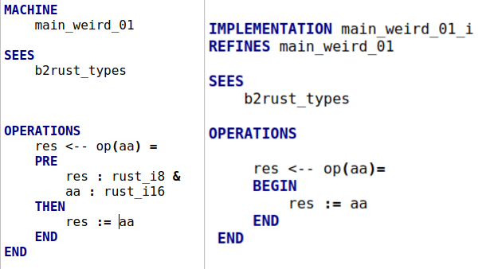{ width=80% }

__Its translation into rust__ :

{ width=80% }

\newpage

**Exception** : It is not possible to convert **array** types (but array element is accepted).  

If the conversion fails, rust panics at runtime. To avoid this problem, lambda functions fit (identity on a domain) are provided. For each assignment, it is recommended to use fit to ensure that the assigner has a type compatible with the assignable.

b2rust ignore fit lambdas function, for example :

	ident := fit_i8(Expression)

is translated into 

	ident = Expression //à conversion près 
	
The syntaxis of the fit can also be extended, as can the operations.     
Note that the suffix of fit lambda function is useless, you can push your self made fit lambda function with any fit functions defined in b2rust_types.mch.  

[See how to extend syntax operations](#extend1)

### Operation call

No constraints in particular, just an explanation of how the function call is translated.  
The idea is simple:  
1) copy the input and output parameters  
2) make a function call on these copies  
3) modify the output parameters with the modified copy.  

This is a mechanism for avoiding the borrowing problem in Rust.

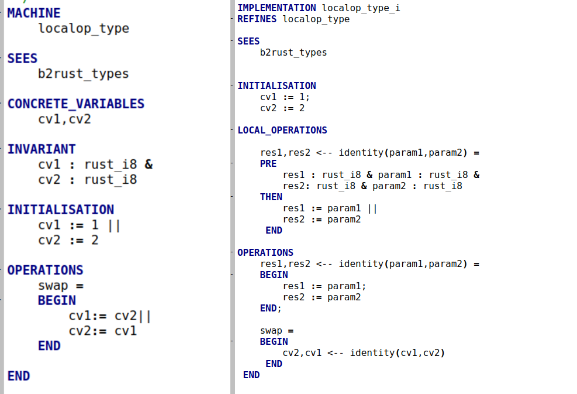{ width=100% }

__Its translation into Rust__:

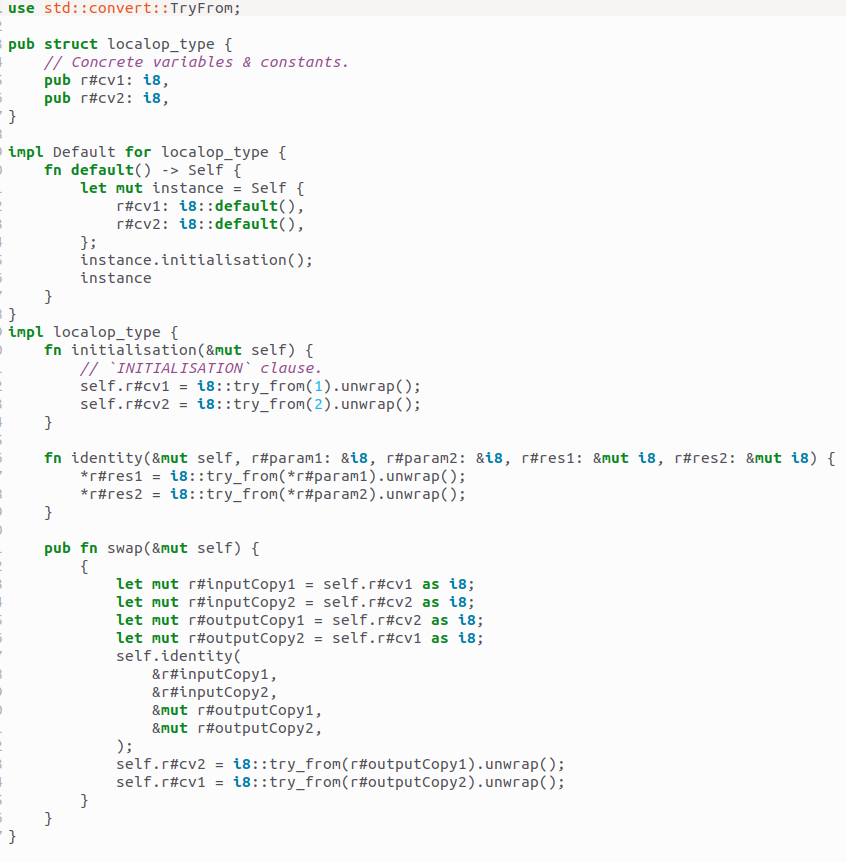{ width=100% }


\newpage

## Referenced machine

| Non terminal        | Productions                                     |
|:---------------------:|:--------------------------------------------:|
| Clause_imports        | ::= "IMPORTS" ( (Ident_ren "["(" Instanciation +",")]")+  )|
| Clause_sees           | ::= "SEES" Ident_ren+ 				|
| Clause_extends       | ::= EXTENDS" ( Ident [ "(" Instanciation +",") ]+",")+","   ")" ] )

Every referenced machine (imported, seen, extended) becomes a field of a struct.

__B code example__ :

{ width=80% }

__And its translation into Rust__ :

{ width=80% }
	
\newpage

### Formal parameters
	
| Non terminal        | Productions                                     |
|:---------------------:|:--------------------------------------------:|
| Instanciation         | ::= TermeSimple 				|
|                       | \|  ExpressionArith 				|
|                       | \|  ExpressionBoolean 				|


The machine's formal parameters must be **typed** in the **INVARIANT** clause.  
Renaming is accepted as long as there is only one renaming prefix.  


In this version of AtelierB, there are still bugs with multiple renaming prefixes in atelierB.   


The translation choice for the formal parameters is to add a **private field** in the Rust struct.  
Then add a constructor named **new** in addition to the default constructor.   
Machines with parameters will be instantiated using new.   

__B code example__ :

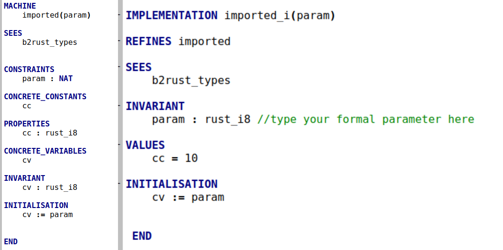{ width=100% }

__And its translation into Rust__ :

{ width=100% }

\newpage


### Basic module {#base_mod}

For machines without an implementation, b2rust generates a file with the extension '.rs.template', which serves as a **template**.  

In the template content :  
- concrete_variables sometimes translated
- concrete_constants sometimes translated and always commented.
- Translatable instructions in initialization are sometimes translated.  
- Operation signatures are **translated**, but the operation body only has a **unimplemented!** macro.


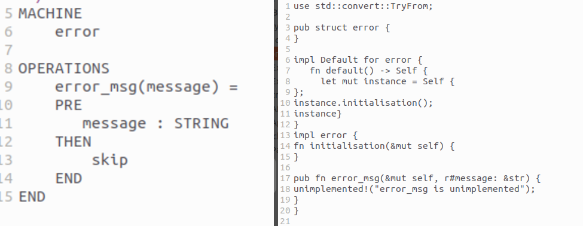{ width=100% }

A bash file **check.sh** is provided to verify that the user has implemented the struct and associated methods. 


### File not intended for translation {#cfg_example}


There are B machines whose only purpose is to serve as a **library** to provide typing information and lambdas functions.These machines are not intended to be translated, but to generate proof obligations, such as 'b2rust_types.mch'.  
To manage this kind of file, b2rust provides a configuration file 'b2rust_exceptions.cfg', the machines inside this file will not be **seen** in the translation by the other machines (they don't become struct fields).  

However, every referenced type in the library that needs to be translated must have an association in b2rust_types.cfg.  
Each lambda function used must have an association in b2rust_operations.cfg


__Example in B__ :

{ width=100% }


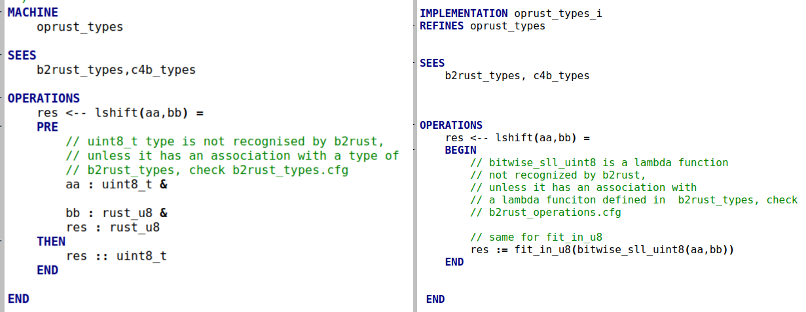{ width=100% }


__And its translation in rust__ :

{ width=100% }


A warning will be triggered if b2rust doesn't recognize the typing information of a concrete data.

\newpage

# Conclusion

For b2rust to generate code, you need to ask yourself the following questions:  
- Are all concrete_constants and concrete_variables typed in the right clause?  
- Do all operations have their input and output parameters typed in the abstract machine precondition?  
- Are local variables typed with BecomesIn or BecomesSuchThat?  
- Are the associations between my types and my function lambdas with those of b2rust_types done correctly?  


	


